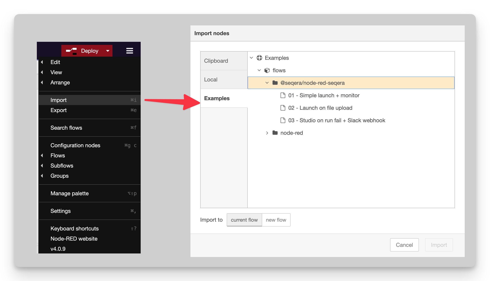
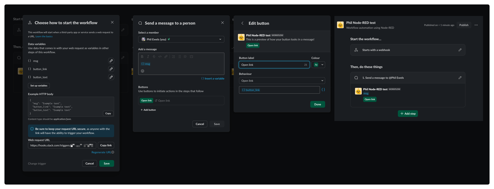

# Node-RED + Seqera: Examples

You can find the Seqera nodes in the sidebar on the left, under the heading "Seqera". To jump-start your development, take a look at the examples that come with the extension:

- Menu (top right `≡` button)
- Import
- Examples (modal's left sidebar)
- @seqera/node-red-seqera dropdown
- Choose an example and import into your current workflow

## Launch on file upload

`examples/poll_file_present.json`

This flow uses the _Poll files_ node to periodically check for the presence
of a file called `RTAcomplete.txt` within a Seqera Data Link (eg. an s3 bucket).

These files are typically uploaded by illumina sequencers when base calling is complete.
But you could configure it to look for the upload of any file path.

When the file is detected, a _List files_ node is used to list all of the files within
that Data Link (bucket - could be configured to use the location that the `RTAcomplete.txt` file is found).

A Node-RED _Function_ node with some javascript then constructs a sample sheet from these filenames.
This is passed to the "Create Dataset" node, which saves it as a Seqera Platform Dataset.

Finally, this is passed to the _Launch workflow_ node, which fires off a pipeline run.

### Setup

Some configuration is needed to make this flow work:

- All Seqera nodes need a Seqera configuration to be assigned
- _Poll files_ and _List files_ need to be configured with the name of a Data Link within Platform
- _Create dataset_ needs a dataset name to be set somehow (dynamically to avoid name clashes)
- _Launch workflow_ needs configuring with the name of a Launchpad pipeline, and parameters.

## Pipeline → Create Studio → Slack webhook

`pipeline_studios_slack.json`

This workflow has three parts to it:

1. Launch and monitor a workflow
   - Just a manual click trigger, in reality you should set this up to some other automation
2. On failure, create a Seqera Studio
   - Create + start a Studio with VSCode and the Data Link mounted
3. Send a message to a Slack workflow webhook
   - Includes workflow status and a button that links to either the workflow run details (on success) or the new Seqera Studios for debugging (on failure)
   - Could equally be any other webhook

If all goes well, you'll get messages in Slack that look like this:

Clicking "Open link" will take you directly to a Studio running VS Code, with your pipeline's work directory mounted and ready to debug.

### Setup

This workflow needs some setup:

- All Seqera nodes need a Seqera configuration to be assigned
- Data Links, Pipelines, and Compute Environments need to be added to nodes
- Slack workflow needs to be created and webook URL entered.

To make the automated Slack message, first you need to create a Slack Workflow.
Selelct _"From a webhook"_ as the trigger:

Then configure with some input variables and a button, and copy the webhook URL. You'll need this later!

